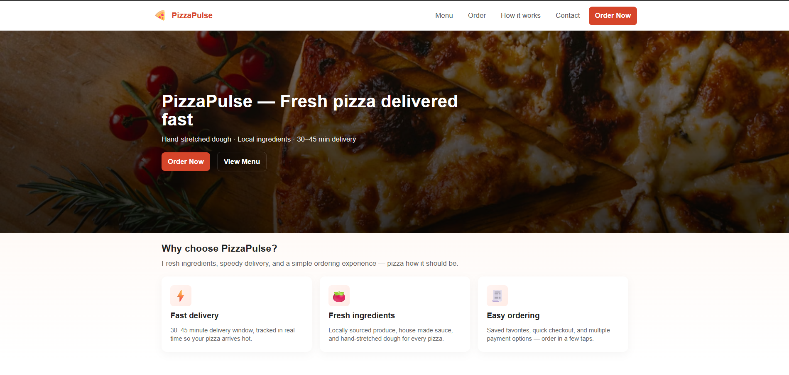

# PizzaPulse

PizzaPulse is a responsive static landing page for a pizza delivery app, built with HTML, CSS, and client-side JavaScript. It features a hero section, menu preview, features, how-it-works steps, contact form, and a clean footer. Use it as a prototype or starting point for a pizza delivery site.

---

## Screenshot




---

## Preview (local)

Recommended: serve locally so images and links work correctly.

```powershell
Set-Location 'D:\Tasks\level1_task1'
python -m http.server 8000
# Open http://localhost:8000 in your browser
```

Or double-click `index.html` for a quick look.

---

## Project structure

- `index.html` — main landing page markup
- `style.css` — all page styles
- `images/` — hero, menu item images, and screenshot

Images included:
- `images/pizzaImage.avif` (hero background)
- `images/Margherita.jpg`
- `images/Pepperoni Classic.jpg`
- `images/Garden Veggie.jpg`
- `images/screenshot.png` (add this yourself)

---

## Key features & behaviors

- Responsive header with mobile hamburger menu
- Hero section with background image
- Features, menu preview, how-it-works, CTA banner, contact form, footer
- Mobile nav toggles with class and aria-expanded
- Smooth scrolling via CSS and JS fallback
- Contact form is client-side only (shows alert, resets form)
- Menu prices in INR (₹)

---

## Customization

- Change hero image: replace `images/pizzaImage.avif` or update the CSS in `.hero`
- Change menu images: replace files in `images/` or update `src` in `index.html`
- Edit text: open `index.html` and modify sections
- Add a screenshot: see above

---

## Git & GitHub

Push to your repo (replace remote URL if needed):

```powershell
Set-Location 'D:\Tasks\level1_task1'
git add .
git commit -m "Update PizzaPulse landing page"
git push -u origin main
```

---

## Publish with GitHub Pages

1. Push to GitHub
2. Go to Settings → Pages, select branch `main` and folder `/ (root)`
3. Your site will be at `https://AdinathJabade.github.io/PizzaPulse/`

---

## Next steps

- Replace emoji icons with SVGs
- Add a cart and backend for orders
- Optimize images and add lazy-loading

---

## License

MIT recommended. Add a LICENSE file if you plan to publish.
